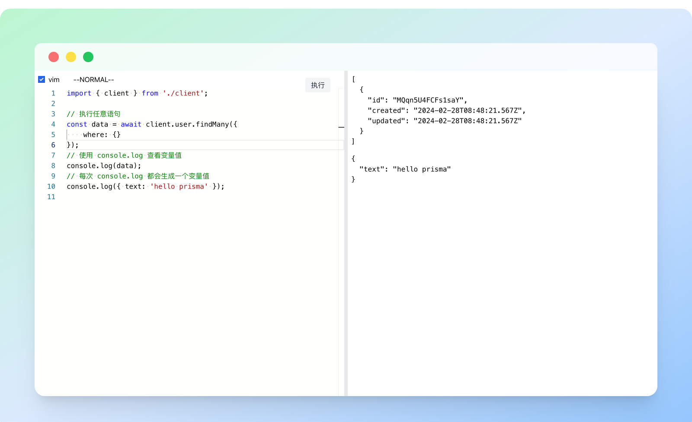

# Prisma Online



在线执行 `prisma` 代码，支持类型提示！

## Usage

```bash
yarn add prisma-online

yarn prisma-online --port 8001
```

### special db file

```bash
yarn prisma-online --port 8001 --db <url_of_db_file>
```
